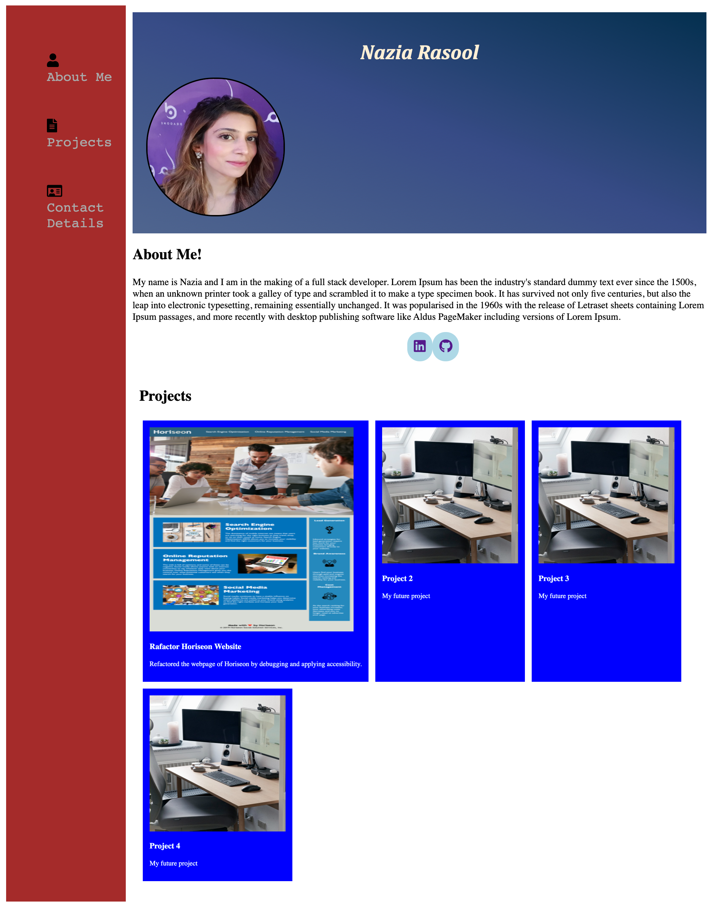

# Portfolio - Nazia Rasool

## Description

 This web application is created from scratch and is intended to build a portfolio page.This portfolio will essentially display all my projects, skills and talents as well as showcase my work and the thought processes behind it. 

## What did we do?

- Created our HTML page with sementic HTML elements.
- Added portfolio picture and other images with alt attributes for better accessibility. 
- Applied pseudo classes to navigation bar and icons.
- Added social-media icons and navigated it to github and linkedin profiles. 
- Added my previous projects with links to the deployed source.  
- Styled my first project to appear bigger than the rest. 
- Applied core skills of flexbox, media queries to give my portfolio a responsive layout that adapts to various viewports. 
- Added bootstrap framework 

## Screenshots

## Link to Deployed Application 

https://nrasool21.github.io/Portfolio/